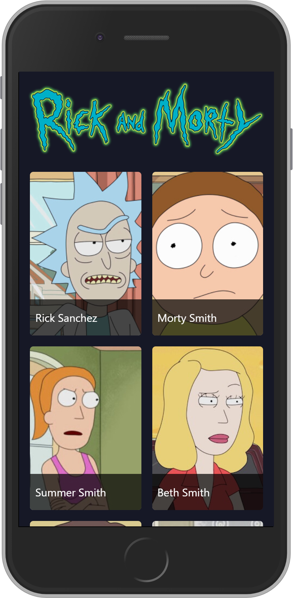

# Rick and Morty Characters

Frontend exercise to consume ricky and morty's API data with the proxy by creating https://github.com/JasanHdz/proxyApiMorty

[See app](https://petgramp-6z10hmwqa.now.sh/)

## How does this work?

Requires Node.JS 10

- `npm install` to install the dependencies.
- `npm run dev` for the development environment.
- `npm run build` for the production environment.

## License

MIT
